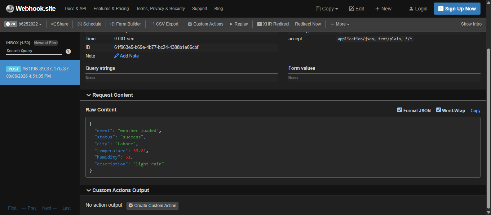

# Week 2 — Weather API Webhook

A simple Node.js + Express server that fetches live weather data for a city from the OpenWeatherMap API, sends the result to a webhook URL, and returns the weather data as a JSON response.

---

## Tech Stack

- Node.js
- Express
- Axios (for HTTP requests)
- dotenv (for environment variables)
- OpenWeatherMap API

---

## Folder Structure

```
week-2/
├── backend/
│   ├── server.js
│   ├── package.json
│   └── .env (not committed — see below)
├── screenshots/
│   ├── JSON Data.png
│   ├── terminal output.png
│   └── webhook.png
└── README.md
```

---

## Setup & Installation

1. Clone the repo and go into the Week-2/backend folder:
```bash
git clone https://github.com/AbdulRehman-Siddiqui/AbdulRehman-Siddiqui-uworx-fellowship.git
cd AbdulRehman-Siddiqui-uworx-fellowship/week-2/backend
```

2. Install dependencies:
```bash
npm install
```

3. Create a `.env` file in the same folder with:
```
API_KEY=your_openweathermap_api_key
WEBHOOK_URL=your_webhook_url
```

4. Run the server:
```bash
node server.js
```

5. Open your browser and go to:
```
http://localhost:3000/weather
```

---

## Environment Variables

| Variable | Description |
|---|---|
| `API_KEY` | Your OpenWeatherMap API key |
| `WEBHOOK_URL` | The endpoint that receives the weather payload after a successful fetch |

---

## How It Works

1. A GET request to `/weather` triggers the server to call the OpenWeatherMap API for the current weather in Lahore.
2. On a successful response, the server builds a payload (event type, city, temperature, humidity, description) and sends it via `axios.post` to the configured `WEBHOOK_URL`.
3. The full weather data from OpenWeatherMap is then returned to the browser as JSON.
4. If anything fails (bad API key, network issue, etc.), the server catches the error and responds with a 500 status and the error message.

---

## API Endpoint

**GET** `/weather`

Fetches current weather for Lahore, sends a webhook notification, and returns the weather data.

### Sample Response

```json
{
  "message": "Weather fetched and webhook sent successfully.",
  "weather": {
    "coord": { "lon": 74.3436, "lat": 31.5497 },
    "weather": [
      { "id": 500, "main": "Rain", "description": "light rain", "icon": "10d" }
    ],
    "base": "stations",
    "main": {
      "temp": 33.81,
      "feels_like": 38.31,
      "temp_min": 33.81,
      "temp_max": 33.81,
      "pressure": 996,
      "humidity": 51,
      "sea_level": 996,
      "grnd_level": 973
    },
    "visibility": 10000,
    "wind": { "speed": 0.62, "deg": 155, "gust": 3.42 },
    "rain": { "1h": 0.81 },
    "clouds": { "all": 54 },
    "dt": 1786016687,
    "sys": {
      "country": "PK",
      "sunrise": 1785975704,
      "sunset": 1786024523
    },
    "timezone": 18000,
    "id": 1172451,
    "name": "Lahore",
    "cod": 200
  }
}
```

---

## Screenshots

**1. Terminal Output** — shows the server console output confirming the weather fetch and webhook send steps.


**2. JSON Data** — shows the JSON response returned in the browser when visiting `/weather`.


**3. Webhook** — shows the payload successfully delivered to the webhook endpoint.



---

## What This Demonstrates

- Making an external API call with Axios
- Handling async/await and errors with try/catch
- Reading sensitive config (API keys, URLs) safely from environment variables using dotenv
- Sending data to a webhook as a POST request
- Returning structured JSON responses from an Express route
